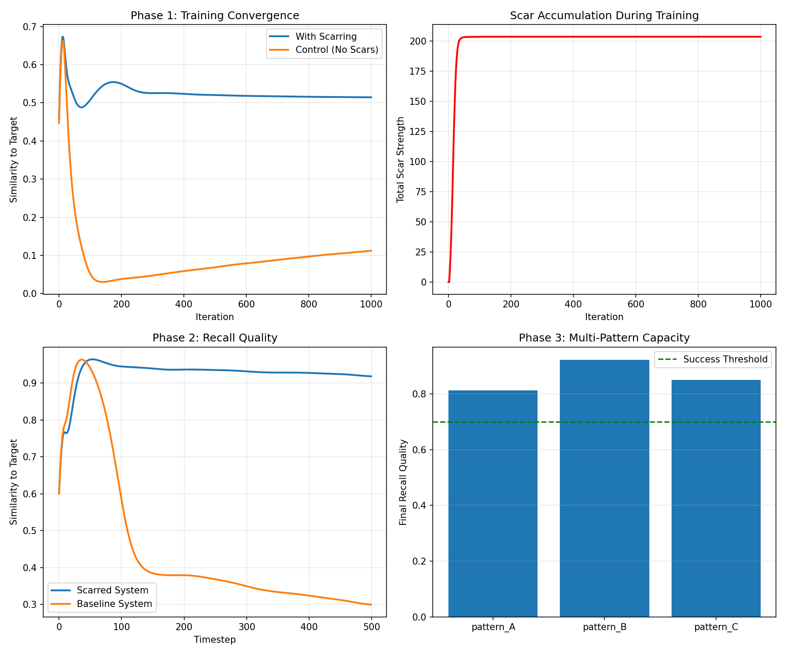

# Parametric Scarring: Memory in Reaction-Diffusion Systems

[](https://opensource.org/licenses/MIT)
[](https://www.python.org/downloads/)
[](https://arxiv.org/)

**Teaching patterns to physics: How substrate modification enables memory formation in continuous dynamical systems**

This repository contains code for experiments demonstrating **parametric scarring**—a memory mechanism where learned patterns are encoded as permanent modifications to the physical parameters governing a reaction-diffusion substrate.

> 🔗 **Blog Post**: [Teaching Patterns to Physics](https://open.substack.com/pub/barzinlotfabadi/p/teaching-patterns-to-physics-memory?r=6j66dp&utm_campaign=post&utm_medium=web&showWelcomeOnShare=true)
> 📄 **Paper**: Coming soon to arXiv
> 👤 **Author**: [Barzin Lotfabadi]([your-linkedin](https://www.linkedin.com/in/barzin-lotfabadi/))

---

## Key Results

- **93.3% recall accuracy** from 15% perturbation strength
- **2.86× improvement** over baseline (no scarring)
- **3 distinct patterns** stored simultaneously with >80% recall quality
- **Zero catastrophic forgetting** across sequential training



---

## What is Parametric Scarring?

Instead of storing memories as weights in a neural network, we modify the **laws of physics** themselves. When a pattern is learned successfully, we adjust the reaction-diffusion parameters (f and k) locally, creating "scars" that make that pattern easier to recreate in the future.

**Key insight**: Memory as substrate modification, not just weight adjustment.

---

## Quick Start

### Installation

```bash
# Clone repository
git clone https://github.com/yourusername/parametric-scarring.git
cd parametric-scarring

# Create virtual environment (recommended, double recommend you use `uv` of course)
uv venv
source .venv/bin/activate  # On Windows: .\venv\Scripts\activate on CMD or .\venv\Scripts\Activate.ps1 via PowerShell

# Install dependencies
pip install -r requirements.txt
```

### Run Experiments

**Full validation experiment** (Phases 1-3, <5 minutes on a cheap GPU):
```bash
python scarring_validation.py
```

Results saved to `scarring_results/`:
- Training/recall visualizations (PNG)
- Parameter scar maps (PNG)
- Quantitative metrics (JSON)
- Summary plots (PNG)

---

## Project Structure

```
parametric-scarring/
├── scarring_validation.py    # Main experiment script
├── requirements.txt           # Python dependencies
├── LICENSE                    # MIT License
├── README.md                  # This file
├── scarring_results/          # Output directory (generated)
│   ├── *.png                  # Visualizations
│   └── results.json           # Metrics
└── docs/                      # Additional documentation
    └── methodology.md         # Detailed methods
```

---

## How It Works

### 1. Substrate: Gray-Scott Reaction-Diffusion

Two chemicals (U and V) diffuse and react across a 2D grid:

```
∂U/∂t = Du∇²U - UV² + f(1-U)
∂V/∂t = Dv∇²V + UV² - (k+f)V
```

Parameters `f` and `k` control pattern formation (spots, stripes, mazes, etc.).

### 2. Scarring Algorithm

```python
def apply_scarring(V, target, F, K, strength=0.003):
    """Modify F/K where current state matches target"""
    match_map = (V > 0.3) & (target > 0.3)
    F[match_map] += strength          # Increase feed rate
    K[match_map] -= strength * 0.5    # Decrease kill rate
    F.clamp_(0.01, 0.08)
    K.clamp_(0.03, 0.08)
```

### 3. Memory Recall

From weak perturbation (15% of target), the scarred substrate reconstructs the full pattern with 93% accuracy.

---

## Experiments

### Phase 1: Single Pattern Training
- Train pattern with/without scarring
- Control collapses to mazes (11.8% similarity)
- Scarred maintains pattern (51.5% similarity)

### Phase 2: Memory Recall
- Weak (15%) perturbation → full reconstruction
- Scarred: 93.3% recall quality
- Control: 32.6% recall quality

### Phase 3: Multiple Patterns
- Train 3 patterns sequentially
- All recalled above 80% quality
- Minimal interference between patterns

---

## Requirements

- Python 3.8+
- PyTorch 2.0+ (GPU recommended)
- NumPy
- Matplotlib
- OpenCV (for video generation)
- SciPy

See `requirements.txt` for exact versions.

---

## Citation

If you use this code or build upon this work, please cite:

```bibtex
@article{lotfabadi2025parametric,
  title={Parametric Scarring: Memory Formation Through Physics Modification in Reaction-Diffusion Systems},
  author={Lotfabadi, Barzin},
  journal={arXiv preprint},
  year={2025},
  url={https://github.com/BarzinL/parametric-scarring}
}
```

**Blog post**:
```
Lotfabadi, B. (2025). "Teaching Patterns to Physics: Memory Formation in
Reaction-Diffusion Systems." Substack. [URL]
```

---

## Limitations

This is early-stage proof-of-concept research. Known limitations:

- ⚠️ **Pattern complexity**: Only tested on simple geometric patterns
- ⚠️ **Capacity**: Unknown how many patterns can be stored before interference
- ⚠️ **Temporal sequences**: Cannot learn A→B→C transitions yet
- ⚠️ **Real-world data**: Audio/visual features untested
- ⚠️ **Scalability**: 256×256 grid has limited representational capacity

See blog post for detailed discussion.

---

## Roadmap

Future experiments (contributions welcome!):

- [ ] Capacity testing (10+ patterns)
- [ ] Temporal sequence learning
- [ ] Audio spectrogram encoding
- [ ] 3D substrate implementation
- [ ] Hierarchical pattern composition
- [ ] Comparison with Neural Cellular Automata
- [ ] Hardware implementation (analog circuits)

---

## Contributing

Contributions are welcome! Areas of interest:

- **Experiments**: Test new patterns, parameters, or substrates
- **Optimization**: Improve computational efficiency
- **Analysis**: Characterize capacity limits, interference patterns
- **Extensions**: Temporal learning, sensory grounding, 3D systems

Please open an issue before starting major work.

---

## License

MIT License - see [LICENSE](LICENSE) file for details.

---

## Related Work

**Reaction-Diffusion Computing**:
- Turing, A. M. (1952). "The Chemical Basis of Morphogenesis"
- Pearson, J. E. (1993). "Complex Patterns in a Simple System"

**Continual Learning**:
- Kirkpatrick et al. (2017). "Overcoming catastrophic forgetting" (EWC)
- Zenke et al. (2017). "Continual Learning Through Synaptic Intelligence"

**Neural Cellular Automata**:
- Mordvintsev et al. (2020). "Growing Neural Cellular Automata"

---

## Contact

**Barzin Lotfabadi**
- 🌐 Website: [sanctus.ca](https://www.sanctus.ca)
- 💼 LinkedIn: [[/in/barzin-lotfabadi](https://www.linkedin.com/in/barzin-lotfabadi/)]
- 📧 Email: barzin@duck.com

---

*"Memory carved into the fabric of simulated physics"*
